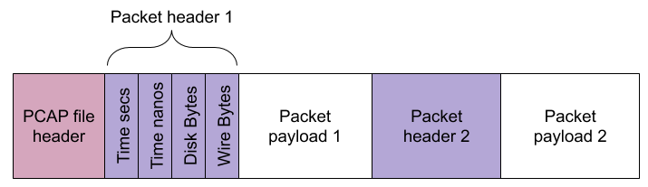
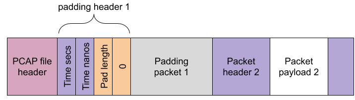

Exact Capture outputs packet captures to a modified `pcap` format called `expcap`.
The `expcap` format is a backwards compatible extension to standard `pcap` format.
A number of [tools and utilities](utils.md) are included for operating on these files and converting them into standard `pcap` format if necessary.

For reference, standard `pcap` files are formatted as follows (more details can be found on the [Wireshark](https://wiki.wireshark.org/Development/LibpcapFileFormat) website):

## Padding Packets
As a performance optimisation, Exact Capture occasionally needs to insert padding packets (e.g. to align to a 4k boundary) into the output file.
These packets are easily recognizable because `pcap` header wire length field (as above) is set to 0B, with the on disk length field (again as above) is set to the size of the padding.

Although setting these header fields precisely captures the semantics of the padding packets (i.e bytes written to disk that were never found on the wire), this is technically a `pcap` file specification violation.
Presumably the writers never envisaged this kind of use case.
Nevertheless, standard tools like `Wireshark` operate correctly and ignore these packets as they should.
The following figure depicts a padding packet directly after the file header.
This will be found in all Exact Capture output files.

## Packet Footers
Each captured packet is extended with a packet footer.
This footer contains a variety of extra fields, not available in the standard pcap format. When the footer is added, the standard pcap disk bytes field is updated to reflect the extra length on disk. Once again, this means that the byes on disk value may exceed the bytes on the wire value (though not always. e.g. when a snaplength is set). The addition of a footer adds bytes to the disk that were never found on the wire is again, technically a PCAP specification violation. However, once again, standard pcap processing tools like Wireshark operate correctly and ignore these extra bytes as they should.  The above figure shows a representation of expcap packet footers added to the first packet.

The additional expcap footer fields are described in detail in the table below. They borrow the spirit of some of the fields found in the ERF format.

<table>
  <tr>
    <th>Field</th>
    <th>Width (bits)</th>    
    <th>Description</th>
  </tr>
  <tr>
    <td>Time (seconds)</td>
    <td>32</td>    
    <td>
      Time in seconds since the epoch
    </td>
  </tr>
  <tr>
    <td>Time (picoseconds)</td>
    <td>40</td>    
    <td>
      Time in picoseconds since the last second boundary
    </td>
  </tr>
  <tr>
    <td>Flags</td>
    <td>8</td>    
    <td>    
      The following flags bits are currently supported:

      <ol>
        <li> New CRC Calculated (The CRC field contains a new new value including the footer) </li>
        <li> Frame aborted - this frame was aborted on the wire by the sender.</li>
        <li> Frame corrupt - the hardware CRC checker detected an error with this frame.</li>
        <li> Frame truncated - this packet was longer than the snap length and has been truncated. </li>
      </ol>
    </td>
  </tr>
  <tr>
    <td>Device ID Number</td>
    <td>8</td>    
    <td>    
      The ID of the device that captured these packets.
      For example, when capturing on the exanic3:7 interface, the device number would be 3.
    </td>
  </tr>
  <tr>
    <td>Port ID Number</td>
    <td>8</td>    
    <td>        
      The port on the device that was used to capture the packet.
      For example, capturing on exanic3:7 interface, the port number would be 7.  
    </td>
  </tr>
  <tr>
    <td>CRC top</td>
    <td>16</td>    
    <td>            
      If the new CRC flag <strong>is not</strong> set, contains the number of packets dropped between this packet and the previous packet.
      Otherwise this is the top 16 bits of the new CRC.
    </td>
  </tr>
  <tr>
    <td>CRC bottom</td>
    <td>16</td>    
    <td>            
      If the new CRC flag <strong>is</strong> set, contains the bottom 16 bits of the new CRC. Otherwise, unused.
    </td>
  </tr>
<table>
