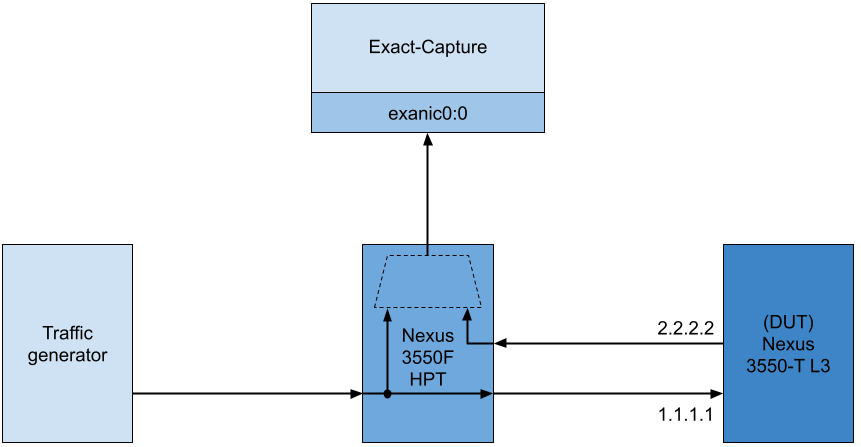
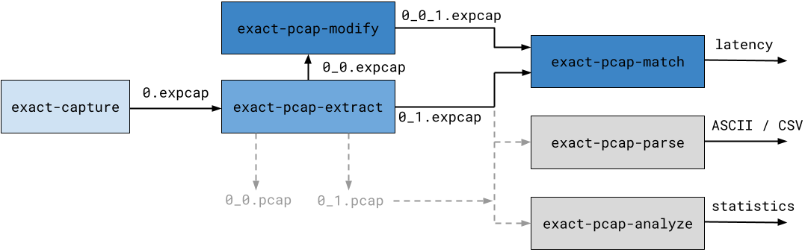

# Additional Tools

Exact Capture ships with a number of additional tools. 
These additional tools are designed to facilitate working with/converting [`expcap`](../expcap.md) formatted output files and to assist with performing benchmarking/performance measurement using exact-capture.
This guide provides an overview of the tools and a detailed example use case to understand how they fit together.

Following is a brief description of each tool:

* **[exact-pcap-extract](extract.md)** - This tool has several functions (which may all be applied at once if required): 
    1. At runtime, exact-capture may be configured to output several `expcap` files (to maximize capture performance). 
    The `exact-pcap-extract` tool can be used to *merge* all of these `expcap` files into one output file. 

    2. Some users may prefer to work with `pcap` formatted capture files instead of `expcap` format.
    `exact-pcap-extract` can be used to convert from `expcap` to standard `pcap` output format. 

    3. Nexus 3550-F HPT devices can append `HPT` (High Precision Timestamping) trailers to packets. 
    Users may want to strip these trailers and recover the timetamps into `expcap` or `pcap` format. 

    4. Users may be interested in the analysing only specific capture ports (as stored in a VLAN header, `HPT` trailer, or `expcap` footer)
    `exact-pcap-extract` can be used to filter packets in the input file(s) so that only a specific capture port is present in the output file. 

    5. Users may be interested in generating a separate output file for every the capture port (as stored in a VLAN header, `HPT` trailer, or `expcap` footer) that is present in the input file(s).
    `exact-pcap-extract` can be configured to steer packets into separate output files based on the capture port ID.

* **[exact-pcap-analyze](analyze.md)** - This tool prints statistics about the packet rates/throughput for a given `pcap` or `expcap` capture file.
  It is useful for "sanity checking" basic properties of a capture file before performing further analysis.
     
* **[exact-pcap-match](match.md)** - A common use case of is for Exact Capture is latency calculations.
  This tool can be used to match identical frames from two `pcap` or `expcap` files and calculate the latency between them.
  If you are measuring latency across a network device which modifies the packet on the way through, the `exact-pcap-modify` application can be used to transform packets so that they match exactly. 

* **[exact-pcap-modify](modify.md)** - This tool can be used to filter and modify header values (Ethernet/IPv4/L4) in `pcap`/`expcap` files.
  It will preserve the original timestamps and capture ports in the packets it modifies which means that it can be used to allow `exact-pcap-match` to match packets that have been modified by network device.

* **[exact-pcap-parse](parse.md)**  - This tool is useful for creating ASCII/CSV text dumps of `pcap` and `expcap` files and for working with picosecond timestamps.
  These ASCII text dumps are easily parsable by external tooling.
  This makes it easy to use (text based) Unix toolchains to quickly perform analysis on packet traces.
  
Source code for all of the tools can be found in the the [`/tools`](https://github.com/exablaze-oss/exact-capture/tree/master/tools) directory of the Exact-Capture source repository.
All of the tools are installed by default and should be available with a working installation of `exact-capture`.

## Example Use Case
To better understand how all of the tools fit together, consider the following example use case. 
In this example, we want to measure the layer 3 forwarding latency performance of a Nexus 3550-T (formerly ExaLINK Triton) switch.
In layer 3 forwarding mode, the the device receives packets, with IP address `1.1.1.1`, and forwards them to IP address `2.2.2.2`, adjusting the packet headers as it does so. 
The measurement configuration is shown in the diagram below:



The above diagram shows a traffic generator, connected to a Nexus 3350-F (formerly ExaLINK Fusion) HPT tap/agg switch.
The Nexus 3550-F HPT has a layer 1 crosspoint switch internally which is used to both send packets to the timesatmping mirror (internally), and, to replicate the same packets out the Nexus 3550-T switch (which is the *Device Under Test*  or DUT).
Timestamped packets are sent to the `exact-capture` host on port `exanic0:0`.
Packets leaving the Nexus 3550-T are sent to the Nexus 3550-F HPT, also timestamped, and also sent to the capture host on port `exanic0:0`.


## Toolchain Overview

The following figure shows an overview of the `exact-capture` toolchain used in this example.
Details of each step are described below. 




## 1. Capture

The first stage required is to generate traffic and capture it with `exact-capture`.
See the [configuration guide](../config.md) for more information on the parameters for `exact-capture`.

```
$ exact-capture -i exanic0:0 -i -exanic1:0 -o ./0 -c 0:1:2,3 -k -S
Exact-Capture 1.0 (00200000-00000080)
Copyright Exablaze Pty Ltd 2018
...
Exact Capture finished
    SW Received: 400011 packets ( 0.007 MP/s )
                     30 MB      ( 0.005 Gb/s )
       SW Wrote: 400011 packets ( 0.007 MP/s )
                     30 MB      ( 0.005 Gb/s )
     Lost RX/WR:      0 packets ( 0.000 MP/s )
                      0 MB      ( 0.000 Gb/s )
        Dropped:      0 packets ( 0.000 MP/s )
   SW Overflows:      0 times   ( 0.000 /s   )
```

The Nexus 3550-F HPT appends picosecond granularity timestamps to packets arriving on two physical interfaces (which are connected to the input and the output ports on the Nexus 3550-T). 
These timestamped packets are multiplexed together and sent to the capture host on `exanic0:0`. 
`exact-capture` will take the packets input from `exanic0:0` and save it to `0.expcap` on the disk.
Once the initial capture data saved on disk, we can begin to process the capture with the rest of the toolchain.

## 2. Extract

Before any other analysis is performed, the captures produced by `exact-capture` needs to be *merged* and *extracted*. 
In the case of this example, only one capture file is created (`0.expcap`), so no merging is necessary. 
However, since there were two capture ports, we would like to extract packets from the trace, and steer them to different files depending on the HPT trailer port number.
This is achieved as follows:

```
$ exact-pcap-extract -i cap0-0.expcap -i  -w 0 -W ./extracted -a -f expcap -s hpt -t
```

This usage will cause `exact-pcap-extract` to steer packets to separate files, depending on which port of the Nexus 3550-F HPT they arrived on.
It allows us to cleanly separate the input and output traffic that was sent to/received from the DUT.
After this stage, there should now be two separate files, `./extracted/0_0.pcap` and `./extracted/0_1.pcap`.

## 3. Modify

Now that we have split the raw capture into two separate files, we would like to match packets in both traces, and derive the latency performance of the 3550-T DUT.
However, because we're benchmarking the 3550-T in layer 3 switch mode, we know that the switch will perform transformations on the input traffic. 
All packets with the destination IP address `1.1.1.1` will be changed to `2.2.2.2` with other fields updated accordingly.
The `exact-pcap-match` tool will attempt to exactly match packets in both traces, so if there are any differences between the two captures passed to `exact-pcap-match` it will not be able to match these correctly.

To resolve this issue, we use `exact-pcap-modify`. 
The `exact-pcap-modify` tool can be used to intelligently modify packets in `pcap` and `expcap` capture files.
In this example use it to modify the ingress traffic (with destination IP `1.1.1.1`) such that it identically matches the egress traffic (with destination IP `2.2.2.2`).
You may think of this operation as performing a kind of 'zero latency', 'perfect' virtual switching operation in software.  
The following example shows the command line to perform this transformation: 

```
$ exact-pcap-modify -i ./extracted/0_0.expcap -w ./0_0_1.expcap -a 1.1.1.1,2.2.2.2 -f expcap
```

This will produce the file `./0_0_1.expcap`, where any packets in `./extracted/0_0.pcap` which had SRC IP 1.1.1.1, will now have SRC IP 2.2.2.2.

## 4. Match

Once two captures have been produced which contain matching packets, `exact-pcap-match` can be used to calcualte the latency delta between matching packets.
It will also indicate which packets failed to match, which can be used as a test for correctness.

```
$ exact-pcap-match -r ./extracted/0_0_1.pcap -i ./0_1.pcap -c matches.csv -f expcap
```

`matches.csv` will contain the timestamps, timestamp deltas (latency) and packet data from all packets in `0_1.pcap` which are also found in `0_0_1.pcap`.

## 5. Parse  (optional) 

It is often convenient to convert packet captures to plain text. 
This means that they can be processed by external tooling which does not need to understand the binary formats.
The `exact-pcap-parse` utility can enable this functionality by extracting `pcap` and `expcap` traces to `.csv` files.
It can be invoked via:

```
$ exact-pcap-parse -i ./0_0_1.pcap -c ./parsed.csv -f expcap
```

In the resulting `.csv` file, each packet is stored on a separate line.
For example, this means that we can easily determine the total number of packets in the capture just by running:

```
$ wc -l ./parsed.csv
100004
```

## 6. Analyze (optional)

Statistics other than traffic latency can be of interest when measuring the performance of a networked device.
For this purpose, the `exact-pcap-analyze` tool can be used to print statistics such as the packet sizes, throughput, inter-frame gaps and packets per second of a given capture.
It can be invoked via:

```
$ exact-pcap-analyze -i ./0_0_1.pcap -f expcap -r 10
PCAP analyser, processing trace...
...
[1613519681.589953512]: offset=99207 window=100.001ms ipt=[7491.397ns < 64252ns < 3085434.147ns] size=[64B < 64.000B < 64B] rate=[0.000pps < 0.097pps < 0.133pps] 0.016Mpps 0.01Gbps
#########################################################
Found 100003 packets in trace "./post_mod_0.pcap"
PCAP trace is 8116276549.47ns long (8116276.5495us, 8.1163s)
Average packet rate is 12321.2904pps (0.0123Mpps)
Packet sizes are in the range [64B,74B]
Interfame gaps are in the range [7472.18ns,2074282148.39ns] note min IFG=0.00ns
Packet rates are in the range [0.00pps,17548.77pps] [0.00Mpps,0.02Mpps]
```
