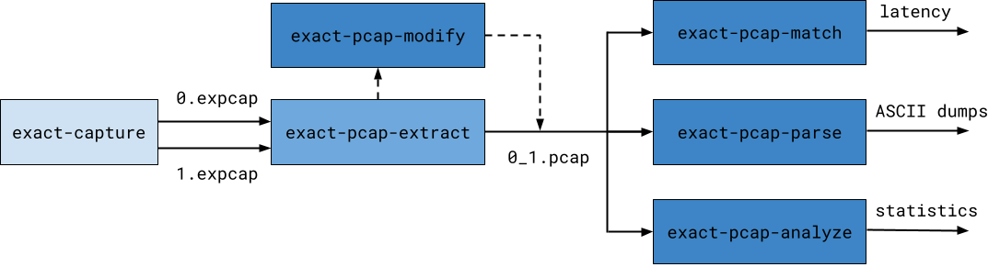
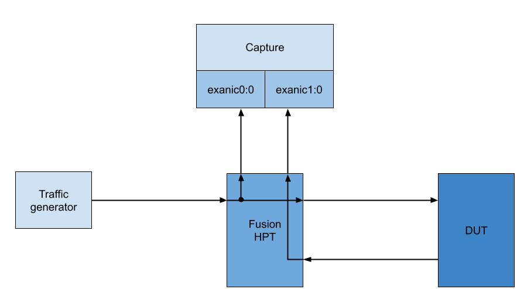

# Overview

The Exact Capture toolchain provides all the functionality necessary to accurately benchmark and measure the performance of network devices.
This guide will demonstrate how each tool can be used to benchmark the performance of a Layer 3 switch.
Here is a brief description of each tool:

* **[exact-pcap-extract](./extract.md)** - This tool is used to merge packets from the separate capture files generated by `exact-capture`.
It can be used to extract the picosecond timestamps present in expcap files and Fusion HPT trailers. 
It can also steer packets to separate files based on the packet contents.

* **[exact-pcap-match](./match.md)** - A common use case of is for Exact Capture is latency calculations. 
This tool can be used to match identical frames from two pcap or expcap files and calculate the latency between them. 

* **[exact-pcap-modify](./modify.md)** - This tool can be used to filter and modify header values (Ethernet/IPv4/L4) in pcap/expcap files.
As it will preserve the original timestamps in the packets it modifies, it can be used to allow `exact-pcap-match` to match packets that have been modified by another device.

* **[exact-pcap-parse](./parse.md)**  - This tool is useful for creating ASCII text dumps of pcap and expcap files and for working with picosecond timestamps.
These ASCII text dumps are easily parsable by external tooling.

* **[exact-pcap-analyze](./analyze.md)** - This tool prints statistics about the packet rates/throughput for a given capture file.

The diagram below provides an overview of how each tool is used.



## Benchmarking

In order to perform this benchmark, we will need a traffic generator and a device that can mirror traffic at the ingress and egress of the device under test (DUT).
This network topology can then be arranged as below:



!!! Note
	In order to benchmark the latency of the DUT, the capture will need to contain traffic in both directions (sent to the device and received from the DUT).
	Exact Capture can only capture **ingress** traffic, so an external device (such as a Fusion HPT) must be used to capture traffic as it is sent to the DUT.

## Capture

The first stage required is to generate traffic and capture it with `exact-capture`.
See the [configuration guide](./config.md) for more information on the parameters for `exact-capture`.

```
$ exact-capture -i exanic0:0 -i -exanic1:0 -o ./cap0 -o ./cap1 -c 0:1:2,3 -k -S
Exact-Capture 1.0 (00200000-00000080)
Copyright Exablaze Pty Ltd 2018
...
Exact Capture finished
    SW Received: 400011 packets ( 0.007 MP/s )
                     30 MB      ( 0.005 Gb/s )
       SW Wrote: 400011 packets ( 0.007 MP/s )
                     30 MB      ( 0.005 Gb/s )
     Lost RX/WR:      0 packets ( 0.000 MP/s )
                      0 MB      ( 0.000 Gb/s )
        Dropped:      0 packets ( 0.000 MP/s )
   SW Overflows:      0 times   ( 0.000 /s   )
```

This capture will take the input from both `exanic0:0` and `exanic1:0` and save it to `cap0-0.expcap` and `cap1-0.expcap`.
This capture contains picosecond timestamps that were produced by the ExaNIC used for capture.
With the initial capture saved on disk, we can begin to process the capture with the utility toolchain.

## Extract

Before any other analysis is performed, the captures produced by `exact-capture` should be merged by `exact-pcap-extract`.
In the previous stage, traffic from two inputs (`exanic0:0` and `exanic1:0`) was written to two different files (`cap0-0.expcap` and `cap1-0.expcap`).
This is because `exact-capture` will spread packets from both ports across both files.

With `exact-pcap-extract` we can merge packets from capture files.
It can also allow packets to be steered to different files depending upon the data in each packet.
We will invoke `exact-pcap-extact` such that the ingress and egress traffic is contained in separate files.

```
$ exact-pcap-extract -i cap0-0.expcap -i cap1-0.expcap -w cap_ext -W ./extracted -a -f expcap -s hpt -t
```

This usage will cause `exact-pcap-extract` to steer packets to separate files, depending on which port of the Fusion HPT they arrived on.
This allows us to cleanly separate the input and output traffic that was sent to/received from the DUT.
After this stage, there should now be two separate files, `./extracted/cap_ext_device_0_port_0.pcap` and `./extracted/cap_ext_device_0_port_1.pcap`.

## Modify

Now that we have split the raw capture into two separate files, we could attempt to match packets and derive analyitcs from the extracted captures.
However, the traffic that was sent to the DUT may not exactly match the traffic that was received back from the DUT.
As we're benchmarking a Layer 3 switch, we know that the switch will perform some transformations on the input traffic depending on its configuration.

Exact PCAP Match will attempt to match packets across the entire packet, so if there are any differences between the two captures passed to `exact-pcap-match` it will not be able to match these correctly.

The `exact-pcap-modify` tool can be used to modify packets in capture files.
We will use it to modify the ingress traffic such that it identically matches the egress traffic.

Suppose that traffic before transformation is located in `./extracted/cap_ext_device_0_port_0.pcap` and traffic captured after the transformation is located in `./extracted/cap_ext_device_0_port_1.pcap`.
For this example, we will also assume that before traffic traversed the device, the SRC IP of outgoing packets was 1.1.1.1 and that the DUT changed the SRC IP to 2.2.2.2.

This means we will need to use `exact-pcap-modify` to modify packets in `./extracted/cap_ext_device_0_port_0.pcap` such that any frames with SRC IP are modified such that the SRC IP becomes 2.2.2.2:

```
$ exact-pcap-modify -i ./extracted/cap_ext_device_0_port_0.pcap -w ./input -a 1.1.1.1,2.2.2.2 -f expcap
```

This will produce the file `./post_mod_0.pcap`, where any packets in `./extracted/cap_ext_device_0_port_0.pcap` which had SRC IP 1.1.1.1 will now have SRC IP 2.2.2.2.

## Match

Once two captures have been produced which contain matching packets, `exact-pcap-match` can be used to determine the latency delta between matching packets.
It will also indicate which packets failed to match, which can be used as a test for correctness.

```
$ exact-pcap-match -r ./extracted/cap_ext_device_1_port_0.pcap -i ./post_mod_0.pcap -c matches.csv -f expcap
```

`matches.csv` will contain the timestamps, timestamp deltas (latency) and packet data from the matching packets in `./extracted/cap_ext_device_0_port_1.pcap` and `./post_mod_0.pcap`.
From this point, additional statistics/analytics can be gathered from the current capture files as required.

## Parse

It is often convenient to convert packet captures to plain text, so that they can be processed by external tooling which does not need to be `pcap` aware.
The `exact-pcap-parse` utility can enable this functionality by extracting packet timestamps and packet data to `.csv` files.
It can be invoked via:

```
$ exact-pcap-parse -i ./post_mod_0.pcap -c ./parsed.csv -f expcap
```

In the resulting `.csv` file each packet is stored on a separate line.
For example, this means that we can easily determine the total number of packets in the capture just by running:

```
$ wc -l ./parsed.csv
100004
```

## Analyze

Statistics other than traffic latency can be of interest when measuring the performance of a networked device.
For this purpose, the `exact-pcap-analyze` tool can be used to print statistics such as the packet sizes, throughput, inter-frame gaps and packets per second of a given capture.
It can be invoked via:

```
$ exact-pcap-analyze -i ./post_mod_0.pcap -f expcap -r 10
PCAP analyser, processing trace...
...
[1613519681.589953512]: offset=99207 window=100.001ms ipt=[7491.397ns < 64252ns < 3085434.147ns] size=[64B < 64.000B < 64B] rate=[0.000pps < 0.097pps < 0.133pps] 0.016Mpps 0.01Gbps
#########################################################
Found 100003 packets in trace "./post_mod_0.pcap"
PCAP trace is 8116276549.47ns long (8116276.5495us, 8.1163s)
Average packet rate is 12321.2904pps (0.0123Mpps)
Packet sizes are in the range [64B,74B]
Interfame gaps are in the range [7472.18ns,2074282148.39ns] note min IFG=0.00ns
Packet rates are in the range [0.00pps,17548.77pps] [0.00Mpps,0.02Mpps]
```
